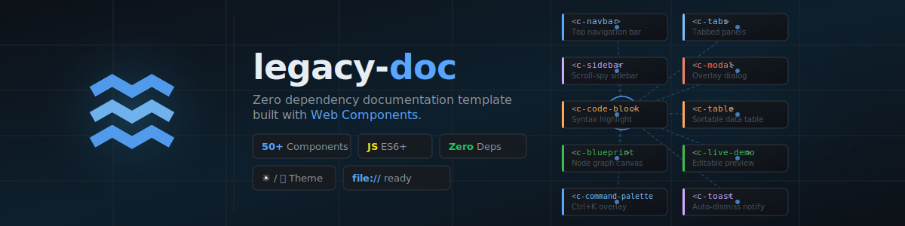

<div align="center">



<br><br>


</div>

---

## Features

- **Zero dependencies** — no npm, no bundler, no framework
- **50 Web Components** — every UI piece is a `<c-*>` custom element with its own `.js` + `.css`
- **Light / dark theme** — CSS variables via `tokens.css`, toggled with a single attribute
- **Command Palette** — `Ctrl+K` / `⌘K` keyboard-driven search overlay across all components
- **Syntax highlighting** — Prism.js with JSON, CSS, HTML and embedded JS/CSS support
- **Blueprint canvas** — draggable node graph with port-to-port bezier connections, pan, zoom, and fullscreen
- **Scroll-spy sidebar** — auto-detects `h2` headings and highlights the active section while scrolling
- **Works from `file://`** — no dev server required

---

## Components

### Layout

| Component | Description |
|---|---|
| `<c-navbar>` | Top bar — logo, brand, theme toggle, GitHub link, mobile hamburger |
| `<c-sidebar>` | Collapsible navigation sidebar with scroll-spy sub-sections |
| `<c-breadcrumb>` | Hierarchical path breadcrumb |
| `<c-theme-toggle>` | Light / dark theme switch with `localStorage` persistence |
| `<c-back-to-top>` | Scroll-to-top button that appears after scrolling |
| `<c-read-progress>` | Scroll-based reading progress bar at the top of the page |

### Content

| Component | Description |
|---|---|
| `<c-callout>` | Highlighted callout box — 7 color variants |
| `.btn` | CSS-only button — variants, outline, sizes, disabled states |
| `<c-card>` | Slotted card with header / body / footer regions |
| `<c-badge>` | Compact HTTP method and status label badges |
| `<c-alert>` | Dismissible notification box |
| `<c-prop-table>` | Component attribute documentation table |
| `<c-comparison>` | Side-by-side Do / Don't comparison block |
| `<c-table>` | Sortable data table |
| `<c-method-signature>` | Function / method signature display |
| `<c-timeline>` | Vertical timeline |
| `<c-tooltip>` | Hover tooltip balloon |
| `<c-image-zoom>` | Click-to-expand image lightbox |
| `<c-divider>` | Labeled or plain horizontal divider |
| `<c-stat>` | Large metric / stat highlight card |
| `<c-skeleton>` | Shimmer-animated loading placeholder |
| `<c-empty-state>` | Empty list / no-results placeholder with illustration slot |

### Docs

| Component | Description |
|---|---|
| `<c-steps>` | Numbered step-by-step guide |
| `<c-kbd>` | Keyboard shortcut display |
| `<c-file-tree>` | Collapsible folder / file tree |
| `<c-api-endpoint>` | REST endpoint inline documentation card |
| `<c-changelog>` | Semantic-version changelog with tag labels |
| `<c-copy-button>` | One-click text copy button |
| `<c-print-button>` | Print-page button |

### Code

| Component | Description |
|---|---|
| `<c-code-block>` | Syntax-highlighted code block with one-click copy |
| `<c-terminal>` | Retro fake terminal window |
| `<c-diff>` | LCS-based before / after line diff viewer |
| `<c-live-demo>` | Editable code panel with live preview |

### Interactive

| Component | Description |
|---|---|
| `<c-tabs>` / `<c-tab>` | Tabbed content panel |
| `<c-accordion>` / `<c-accordion-item>` | Collapsible accordion |
| `<c-toc>` | Auto-generated table of contents with scroll-spy |
| `<c-pagination-nav>` | Previous / next page navigation links |
| `<c-search-box>` | Client-side live-filter search box |
| `<c-blueprint>` | Draggable node diagram with port-to-port bezier connections |
| `<c-heading-anchor>` | Copyable anchor icon on headings |
| `<c-modal>` | Overlay dialog — ESC and outside-click to close |
| `<c-feedback>` | Page feedback button |
| `<c-toast>` | Temporary notification — stacks bottom-right, auto-dismisses |
| `<c-popover>` | Rich-content balloon triggered by click |
| `<c-command-palette>` | `Ctrl+K` / `⌘K` keyboard-driven search overlay |
| `<c-banner>` | Page-top announcement bar — deprecation, beta, breaking-change |

### Design System

| Component | Description |
|---|---|
| `<c-color-swatch>` | CSS color token visualizer with click-to-copy |
| `<c-font-scale>` | Typography token scale display |
| `<c-spacing-scale>` | Spacing token scale with real-size bars |
| `<c-icon-gallery>` | SVG icon grid — loads from JSON manifest, click to copy |

---

## Structure

```
legacy-doc/
├── index.html                    # Component gallery home
├── pages/                        # One demo page per component (50 pages)
├── components/                   # <c-*> Web Components (.js + .css pairs)
│   ├── c-navbar/
│   ├── c-sidebar/
│   ├── c-command-palette/
│   └── ...
└── assets/
    ├── css/
    │   ├── tokens.css            # CSS variables — color, spacing, radius, theme
    │   └── base.css              # Reset, typography, page layout
    ├── js/
    │   └── project.js            # Project metadata (name, version, github URL)
    └── vendor/
        └── js/prism.min.js       # Bundled Prism for syntax highlighting
```

---

## Quick Start

Add a component to any page:

```html
<!-- <head> -->
<link rel="stylesheet" href="../components/c-alert/c-alert.css">

<!-- before </body> -->
<script src="../assets/js/project.js"></script>
<script src="../components/c-alert/c-alert.js"></script>

<!-- markup -->
<c-alert variant="success" dismissible>Saved successfully.</c-alert>
```

Drop the `<link>` and `<script>` for any component you don't need — nothing else is affected.

---

## Adding a Component

1. Create `components/c-name/` with `c-name.css` and `c-name.js`.

2. Define the element in `c-name.js`:

   ```js
   class CName extends HTMLElement {
       connectedCallback() { /* render here */ }
   }
   customElements.define('c-name', CName);
   ```

3. Use variables from `tokens.css` for all colors and sizes — no hardcoded values.

4. Create a demo page at `pages/name.html` (copy any existing page as a template).

5. Register the page in `components/c-sidebar/c-sidebar.js` under `NAV_GROUPS`:

   ```js
   { id: 'name', label: 'Name', file: 'name.html' }
   ```

---

## Project Config

All project-level metadata lives in `assets/js/project.js`:

```js
window.PROJECT = {
    name:    'legacy-doc',
    version: '1.5.0',
    brand:   'Component Galerisi',
    github:  'https://github.com/Moon-Chain/legacy-doc',
};
```

`<c-navbar>` and `<c-sidebar>` read from this object automatically — no attribute changes needed across pages when the version or URL changes.

---

## License

MIT — © 2025 Moon-Chain
